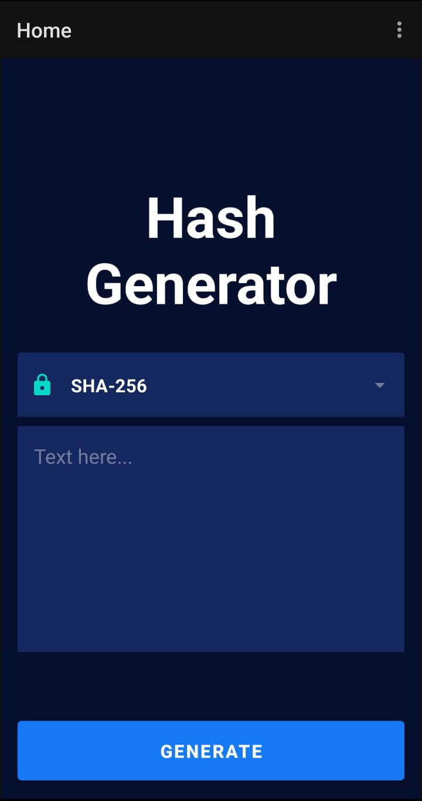
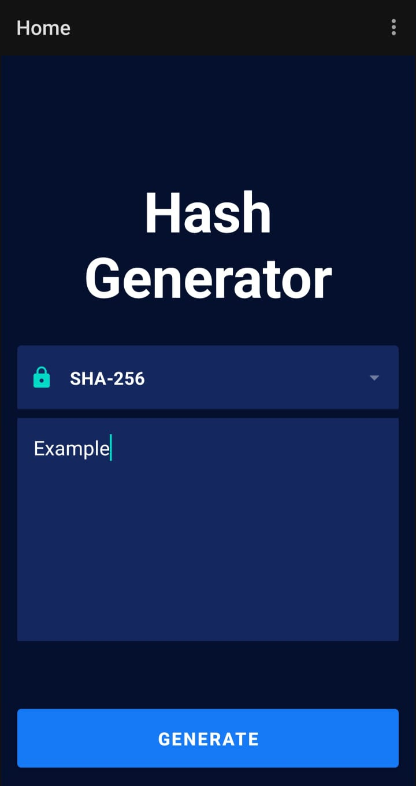
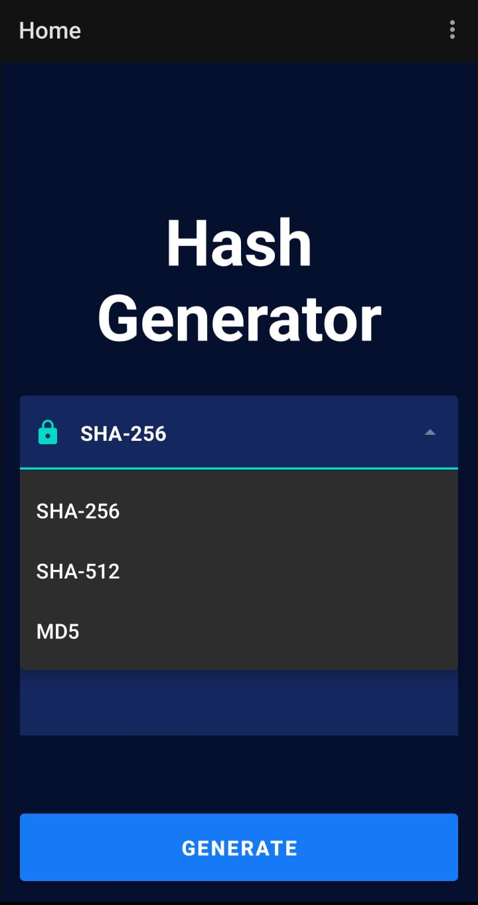
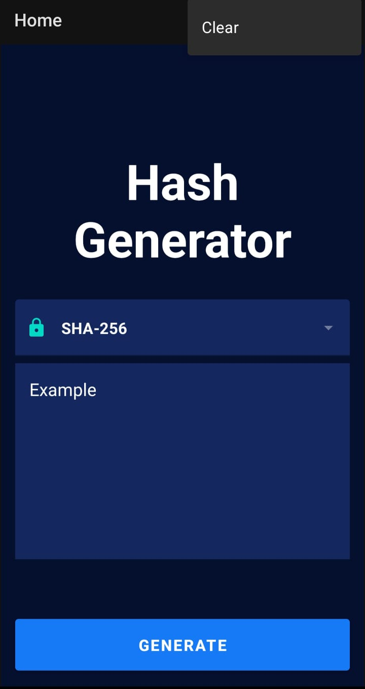
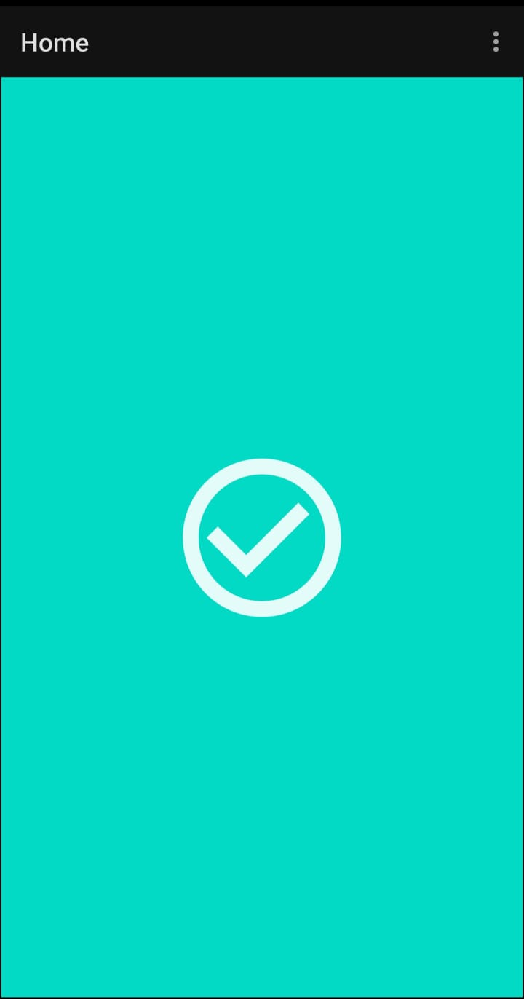
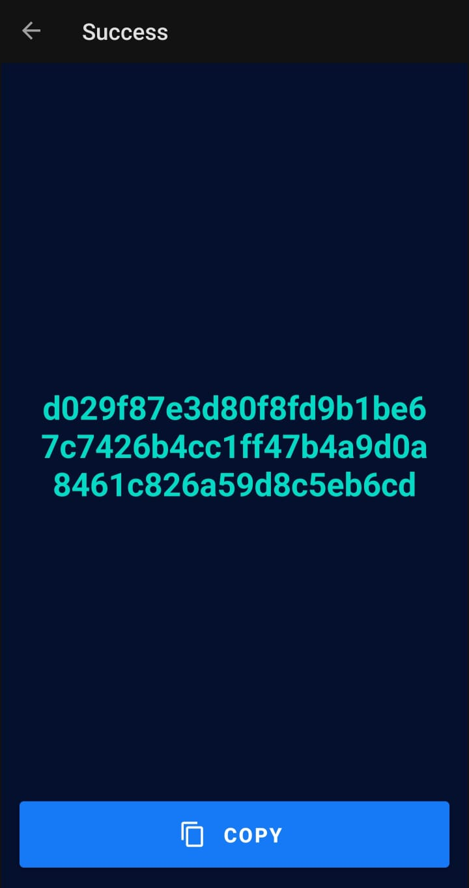
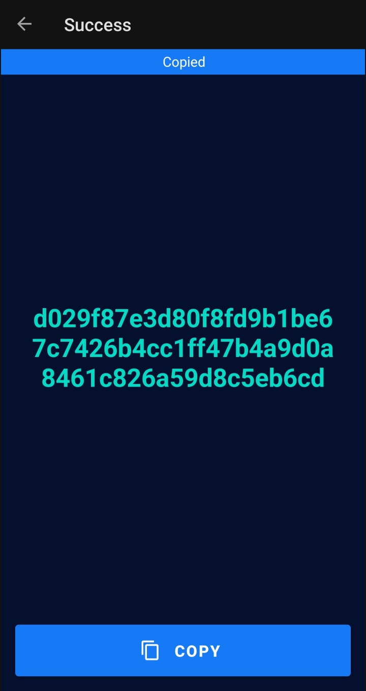

# Hash Generate App

The app main purpose is to generate hash encode by the given string.
At this moment, only three encode type were used: SHA-256, SHA-512 and MD5.
By selecting one of the three encoding types and next paste the required string, you can generate your hash encode by clicking upon the "Generate" Button, right down below the string box. At the next screen, the app will show you the generated hash string.

## 🔧 Used resources

### Jetpack Components:
- Navigation

### Android Resources:
- View Model
- View Binding
- Coroutines

## Images

  
  
  
  
  
  
  

## Developed with:

## 🔖 License

### Contact

Copyright © 2021 MrMindy

